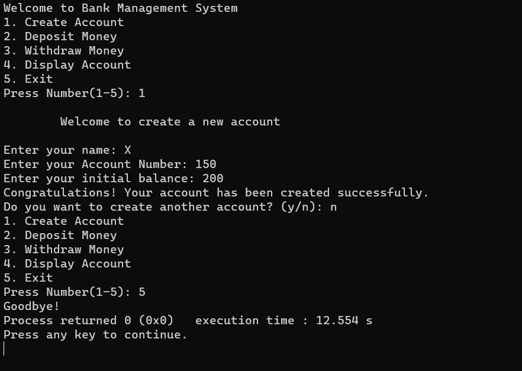

# Bank Management System C++



## Overview

Welcome to the Bank Management System C++ project! 🏦✨ Manage your bank accounts seamlessly with this intuitive console-based application.

## Features 🚀

- **User-Friendly Menu:**
  - Create Account
  - Deposit
  - Withdraw
  - Display Accounts
  - Exit

- **Create Account (Option 1):**
  - User-friendly prompts for account details.
  - Storage using arrays (`accountNumbers`, `accountHolderNames`, `accountBalances`).

- **Deposit (Option 2):**
  - Deposit prompt with account number and amount.
  - Updates account balance with a sleek display.

- **Withdraw (Option 3):**
  - Withdrawal with a check for sufficient balance.
  - Error message for insufficient funds.

- **Display Accounts (Option 4):**
  - Displays all accounts in a neat format.
  - Code structure with proper indentation and meaningful variable names.

- **Exit (Option 5):**
  - Bid farewell with a goodbye message.

## Demo 🎥


## Getting Started 🚀

1. Clone the repository.
   ```bash
   git clone https://github.com/iMamoonAkhter/Bank_Management_System_C-
